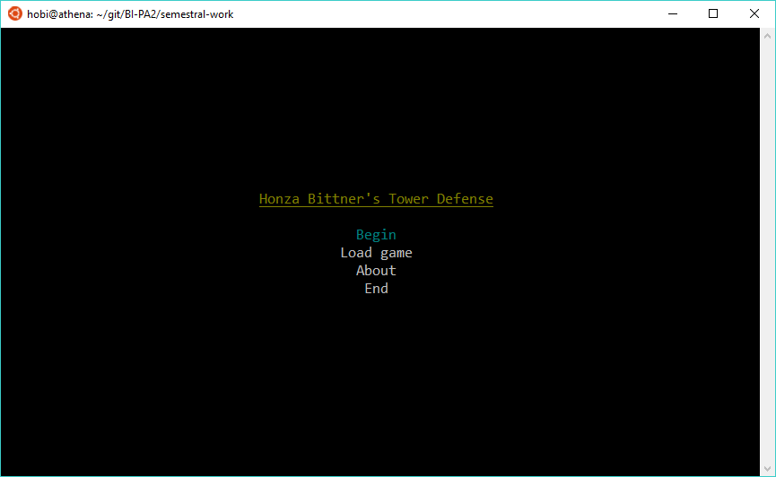
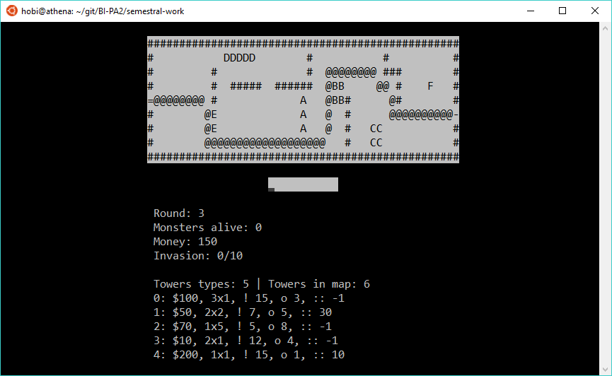

# Semestral work

Two-day work full of helplessness, weeping and suffering.

My result: 11.70 / 12.00 :relaxed:

## [Assignment (in Czech)](zadani.txt)

## Screenshot

### Main menu

Main screen contains a few items to select. Nothing unusual.

### Game screen

In the game screen you can see the map with `#` for wall, `@` for road, some letter for each tower and ` ` for empty cell.

In the command prompt you can use `exit`, `save` and `tower` commands. How to use them is described in info screen after using the particular command.

